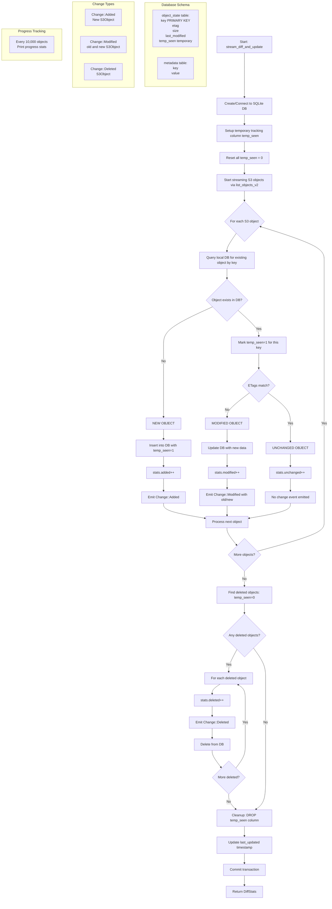

# Resy

**Re**mote **Sy**nc change detection lib. Currently supporting AWS S3 but possibly open to more sources.

## Usage

### Basic Example

```rust
use resy::s3::S3;
use resy::Change;
use tokio_stream::StreamExt;

#[tokio::main]
async fn main() -> Result<(), Box<dyn std::error::Error>> {
    // Build S3 client using the builder pattern
    let s3 = S3::builder()
        .bucket("my-bucket")
        .region("us-east-1")
        .credentials("AKIA...", "secret...")
        .build()
        .await?;

    // Stream changes - database path is auto-generated as "{bucket}.db"
    // Or specify custom path: s3.stream_changes(Some(Path::new("custom.db")))
    let mut stream = s3.stream_changes(None);

    while let Some(result) = stream.next().await {
        match result {
            Ok(change) => match change {
                Change::Added(obj) => {
                    println!("Added: {} ({} bytes)", obj.key, obj.size);
                }
                Change::Modified { old, new } => {
                    println!("Modified: {} ({} -> {} bytes)", 
                        new.key, old.size, new.size);
                }
                Change::Deleted(obj) => {
                    println!("Deleted: {} ({} bytes)", obj.key, obj.size);
                }
            },
            Err(e) => {
                eprintln!("Error: {}", e);
                break;
            }
        }
    }

    Ok(())
}
```

### Builder Options

The S3 builder supports several configuration options:

```rust
let s3 = S3::builder()
    .bucket("my-bucket")              // Required
    .region("us-west-2")              // Required
    .credentials(key, secret)         // Required
    .endpoint("http://localhost:4566") // Optional: for LocalStack/MinIO
    .page_size(500)                   // Optional: S3 pagination size (default: 1000)
    .db_path("custom.db")             // Optional: custom state DB path
    .build()
    .await?;
```

## Security

AWS credentials are wrapped in `SecretString` with automatic memory zeroing via the `Zeroize` and `ZeroizeOnDrop` traits, ensuring secrets are cleared from memory when no longer needed.

Access to credentials is controlled through private getter methods that only expose secrets when explicitly needed for AWS API calls. The system uses read-only S3 operations (`list_objects_v2`) without requiring write permissions, following the principle of least privilege.

State persistence uses local SQLite databases with no network exposure, and the database schema stores only metadata (keys, ETags, sizes, timestamps) without any file contents or sensitive data, minimizing the attack surface while maintaining functionality.

## Scalability

Resy is designed for scalability across large buckets and frequent operations.

It uses AWS S3's paginated `list_objects_v2` API with configurable batch sizes (default 1000 objects) and **continuation tokens** to handle buckets with millions of objects without memory exhaustion.

The streaming architecture processes objects one-by-one rather than loading everything into memory, making it memory-efficient for large-scale operations.

SQLite with **async sqlx** provides efficient local state persistence with indexed lookups on ETags for fast comparisons, while the temporary `temp_seen` column approach enables single-pass change detection without requiring multiple database scans.

Database transactions ensure consistency during concurrent operations, and the compact storage format (storing only metadata, not file contents) keeps the state database lightweight even for buckets with terabytes of data, making the system suitable for enterprise-scale S3 monitoring and synchronization tasks.

## How it works


